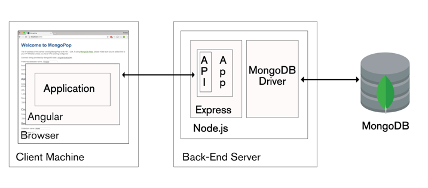

>Überlege dir welche geeignete Mittel man einsetzen kann, um ein kollaboratives Entwickeln zu gewährleisten und die Qualität des Codes möglichst hoch zu halten.

- Nutzung eines Versionskontrollsystems wie GIT sowie eines zentralen Hosters wie etwa Github oder Gitlab
  - Zudem verwende ich Github Action als CI/CD Pipeline. Dabei werden sowohl Linter- als auch Test-Tasks ausgeführt. (TODO)
    - Sind die Schritte der Pipeline erfolgreich, wird das auf GitHub Pages gehostete Frontend aktualisiert. (TODO)
  - bei tatsächlicher kollaborativer Arbeit wären zudem noch ratsam folgende Dinge zu tun:
    - der Push-Zugriff sollte bei wichtigen Branches eingeschränkt werden.
    - Nutzung von Issue-Tracker sowie Tools wie Jira und Kanban-Boards für User Stories etc.
    - ggf. SonarQube oder andere Static-Code-Analyse Tools

>Wie könnte man die bestehende Schnittstelle in eine eigene CRUD Schnittstelle umbauen? Wie sähe eine solche Architektur aus und welchen TechStack könnte man einsetzen?

- Erstellung eines Backend-Servers auf Basis von Node.js und Express.js
  - Das Frontend würde nun nicht mehr mit `geoportal.stadt-koeln.de` kommunizieren sondern mit dem neuen Backend Server.
    - REST-Endpoints des Backends stellen die CRUD-Funktionalität bereit.
  
- `/api/v1/gas-station` (POST, GET)
- `/api/v1/gas-station/:id` (GET, PATCH, DELETE)

- GET Zugriff auf `/api/v1/gas-station` liefert weitestgehend die selbe JSON-Response wie der alte Server
  - reale Datenquelle ist nun aber eine eigene Datenbank (MongoDB)
    - diese kann die bestehende JSON Daten unverändert in einer MongoDB document collection speichern
  - der alte Datensatz könnte mithilfe von Datenbank-Admin-Tools (z.B. MongoDB Compass) importiert werden.
    - alternativ wird für jede "Tankstelle" einmal der POST Endpoint via postman / curl / axios aufgerufen. 
    
- Frontend kann dann erweitert werden um von der neuen Funktionalität Gebrauch zu machen
  - Create via HTTP-POST (Daten aus Frontend Form)
    - Backend entnimmt die Daten aus dem JSON Body
      - nach dem Durchlauf von sanity check wird der neue Datensatz zur Datenbank geschickt (`insertOne()`)
      - Backend sendet Status und ggf. Location Header zurück
          - Frontend reagiert auf Erfolg oder Fehler der HTTP-POST Request 
  - Analoges Vorgehen bei        
    - Update via HTTP-PATCH
    - DELETE via HTTP-DELETE
  - ggf. neue Features hinzufügen wie z.B. ein Query Parameter `PLZ` für GET `/api/v1/gas-station`



 
- Insgesamt wird also der [MEAN Stack](https://en.wikipedia.org/wiki/MEAN_(solution_stack%29) verwendet
  - https://www.mongodb.com/blog/post/the-modern-application-stack-part-1-introducing-the-mean-stack
  - genau diesen Stack habe ich auch im letzten Wintersemester benutzt
    - [Kurs Integration Architectures](https://eva2.inf.h-brs.de/studium/curriculum/2017/matrix/bi/473/en/)


>Was wären geeignete Maßnahmen um die Applikation zu hosten? 

Zur Entwicklungszeit:
```
git clone
cd 
npm install
npx ng serve --open
```

Dies sind Anweisungen, um die "self-contained build artifacts" zu erzeugen, die von einem beliebigen statischen Webserver gehostet werden können.
Hier wird beispielhaft der Python's `http.server` verwendet, aber auch alle anderer Server (Apache, Nginx) oder Services (GitHub Pages, S3) können verwendet werden.

```
$ npx ng build

Initial chunk files   | Names         |  Raw size | Estimated transfer size
main-SKPXXMX2.js      | main          | 724.41 kB |               154.52 kB
polyfills-FFHMD2TL.js | polyfills     |  34.52 kB |                11.28 kB
styles-36AW6TKX.css   | styles        |   6.98 kB |                 1.13 kB

                      | Initial total | 765.91 kB |               166.93 kB

Application bundle generation complete. [4.307 seconds]

▲ [WARNING] bundle initial exceeded maximum budget. Budget 500.00 kB was not met by 265.91 kB with a total of 765.91 kB.


Output location: /home/lukas/Documents/cologne_gas/frontend/dist/frontend

$ ls /home/lukas/Documents/cologne_gas/frontend/dist/frontend/browser/
favicon.ico  index.html  main-SKPXXMX2.js  polyfills-FFHMD2TL.js  styles-36AW6TKX.css

$ cd /home/lukas/Documents/cologne_gas/frontend/dist/frontend/browser/
$ python -m http.server
```


>Stelle uns deinen Quellcode zur Verfügung.
